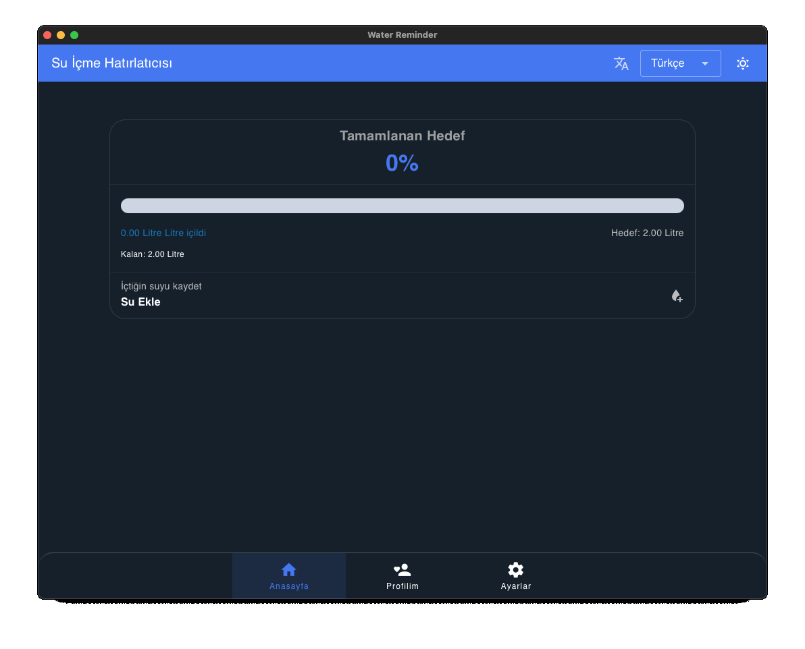

# Water Reminder (Tauri + Vue 3 + Pinia)

<p align="center">
	
</p>

This application is a robust, cross-platform desktop solution designed to enhance daily hydration habits. Built with a modern tech stack including Tauri for native performance, Vue 3 for a dynamic user interface, and Pinia for efficient state management, it offers a seamless and intuitive experience for tracking water intake and ensuring consistent hydration through intelligent reminders.

### Key Features & Benefits

* **Intelligent Hydration Reminders:** Configurable notification schedules allow users to receive timely reminders to drink water, preventing dehydration and promoting consistent intake.
* **Personalized Hydration Goals:** Users can set and track daily water intake targets, with progress visualized for easy monitoring and motivation.
* **User-Centric Customization:** Flexible settings for notification frequency, silent hours (wake/sleep times), and notification enablement ensure the application adapts to individual lifestyles without disruption.
* **System Integration (Autostart):** Seamless integration with the operating system allows the application to start automatically, ensuring continuous hydration support from the moment the user logs in.
* **Modern UI/UX:** A clean, responsive, and intuitive interface powered by Vue 3 offers an engaging user experience.
* **Lightweight & Performant:** Leveraging Tauri, the application delivers near-native performance with a significantly smaller footprint compared to Electron-based alternatives, ensuring minimal resource consumption.
* **Data Privacy & Security:** User data and settings are stored locally, emphasizing privacy and offering a secure personal health tracking solution.
* **Multi-language Support:** The application supports multiple languages, catering to a diverse user base.
* **Daily Reset Mechanism:** Water intake and goal completion status automatically reset daily, providing a fresh start and continuous motivation.

### Technical Stack

* **Tauri:** A framework for building secure, optimized, and cross-platform desktop applications using web technologies. Written in Rust, it ensures high performance and security.
* **Vue 3:** The progressive JavaScript framework for building user interfaces, offering reactivity, component-based architecture, and excellent performance.
* **Pinia:** A lightweight and intuitive state management library for Vue, providing a simple yet powerful way to manage application data.
* **Vuetify:** A comprehensive Material Design framework for Vue.js, providing a rich set of pre-built UI components for rapid development.

## Getting Started

To set up and run the project locally, follow these steps:

1.  **Clone the Repository:**

    ```bash
    git clone https://github.com/mertcan-tas/water-reminder.git
    ```

2.  **Install Dependencies:**

    ```bash
    pnpm install
    ```

3.  **Run in Development Mode:**

    ```bash
    pnpm tauri dev
    ```

4.  **Build for Production:**

    ```bash
    pnpm tauri build
    ```

    Upon successful compilation, the executable files will be located in the `src-tauri/target/release` directory.

## Bug Reports

If you encounter any bugs or issues while using the application, please open an issue on the GitHub repository. Your feedback is valuable for improving the application.

## License

This project is licensed under the GPL-3.0 License. See the `LICENSE` file for more details.

