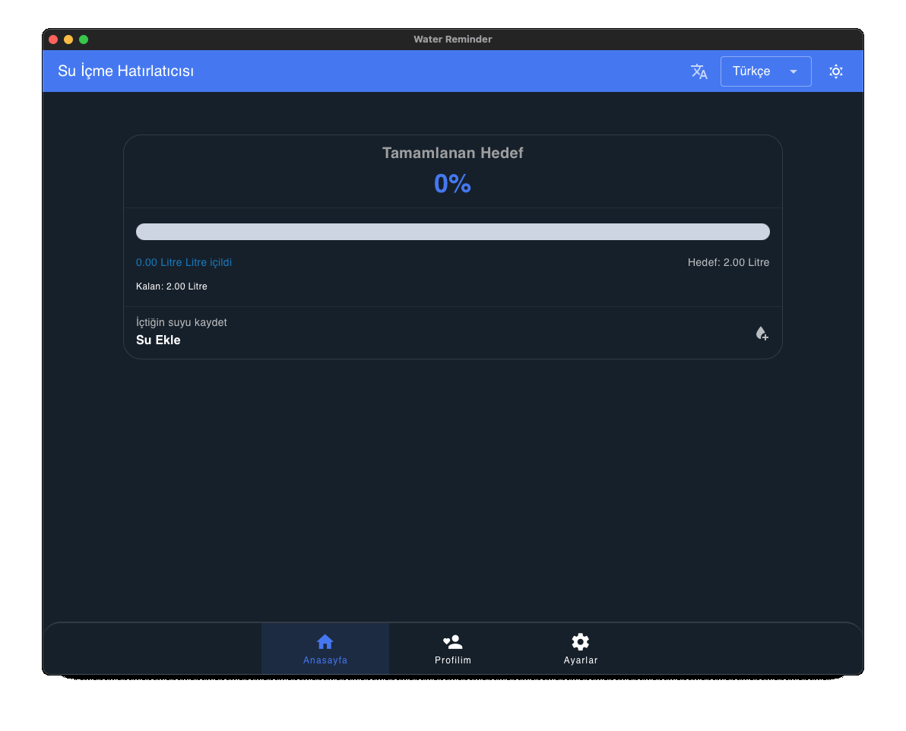

# Water Reminder

> A lightweight, local-first desktop app that reminds you to drink water and helps you reach your daily hydration goal.

<p align="center">
	
</p>

## Description

Water Reminder is a cross-platform desktop application that helps you build a
consistent hydration habit. It runs quietly in the system tray and sends you
configurable reminders to drink water throughout your day, tracks your intake
against a personalized daily goal, and celebrates when you hit your target.

The app is built with [Tauri](https://tauri.app/), so it ships as a small,
fast, native binary instead of a heavy browser bundle. All of your data and
settings are stored locally on your machine — nothing is sent anywhere.

## Features

- **Hydration reminders** — Receive native desktop notifications at a frequency
  you choose (every 1, 30, 60, 90, 120, or 180 minutes).
- **Daily goals** — Set a daily water target (manually, or auto-calculated from
  your weight, age, and activity level) and watch your progress fill up.
- **Silent hours** — Configure wake-up and sleep times so reminders are only
  sent while you are awake. Overnight ranges (e.g. 22:00 → 07:00) are handled
  correctly.
- **Autostart** — Optionally launch the app automatically when you log in.
- **System tray** — The window minimizes to the tray on close; reopen, restart,
  or quit from the tray menu.
- **Multi-language** — Ships with English and Turkish, switchable at runtime.
- **Daily reset** — Your water intake and goal-completion status reset
  automatically at the start of each day.
- **Goal celebration** — Confetti and a sound effect when you reach your goal.
- **Local-first** — All profile data and settings are persisted on disk via the
  Tauri Store plugin; no account or network connection required.
- **Light & dark themes** — Toggle between themes at any time.

## Tech Stack

- **[Tauri](https://tauri.app/) (Rust)** — Cross-platform native shell and
  build tooling.
- **[Vue 3](https://vuejs.org/)** — Frontend framework (Composition + Options API).
- **[Vuetify 3](https://vuetifyjs.com/)** — Material Design component library.
- **[Pinia](https://pinia.vuejs.org/)** — State management.
- **[Vue Router](https://router.vuejs.org/)** — Client-side routing.
- **[vue-i18n](https://vue-i18n.intlify.dev/)** — Internationalization.
- **[Vite](https://vite.dev/)** — Frontend build tooling.

### Tauri plugins

- `@tauri-apps/plugin-notification` — native desktop notifications
- `@tauri-apps/plugin-autostart` — launch on login
- `@tauri-apps/plugin-global-shortcut` — global keyboard shortcuts
- `@tauri-apps/plugin-store` — local key/value persistence
- `@tauri-apps/plugin-process` — relaunch / exit the app
- `@tauri-apps/plugin-opener` — open external resources

## Prerequisites

- **[Node.js](https://nodejs.org/)** 18 or newer
- **[pnpm](https://pnpm.io/)** (this project pins a `pnpm` version via
  `packageManager`; install with `corepack enable` or from the pnpm website)
- **Rust toolchain** — install via [rustup](https://rustup.rs/)
- The platform-specific system dependencies required by Tauri. See the
  [Tauri prerequisites guide](https://tauri.app/start/prerequisites/) for your
  operating system.

## Install

Clone the repository and install the frontend dependencies:

```bash
git clone https://github.com/mertcan-tas/water-reminder.git
cd water-reminder
pnpm install
```

## Development

Run the Vite dev server (frontend only, in the browser):

```bash
pnpm dev
```

Run the full desktop app in development mode (Tauri window with hot reload):

```bash
pnpm tauri dev
```

## Build

Build the frontend assets into `dist/`:

```bash
pnpm build
```

Build the production desktop binaries and installers:

```bash
pnpm tauri build
```

The compiled executables and bundles are written to
`src-tauri/target/release/` (with platform installers under
`src-tauri/target/release/bundle/`).

## Project Structure

```
water-reminder/
├── index.html                # Vite entry HTML
├── vite.config.js            # Vite + Vuetify + Fonts configuration
├── src/                      # Vue frontend
│   ├── main.js               # App bootstrap & store/service init
│   ├── App.vue               # Root component, system tray & window logic
│   ├── assets/               # Styles, sounds, preview image
│   ├── components/           # Reusable UI components
│   ├── layouts/              # App bar, bottom navigation, base layout
│   ├── plugins/              # Pinia stores, router, Vuetify, i18n
│   │   ├── stores/           #   theme / settings / user stores
│   │   └── i18n/locales/     #   en.js, tr.js
│   ├── services/             # Notification, schedule & local-store services
│   ├── utils/                # Confetti & alert helpers
│   └── views/                # Home, Profile, Settings pages
└── src-tauri/                # Rust / Tauri backend
    ├── Cargo.toml            # Rust dependencies
    ├── tauri.conf.json       # Tauri app configuration
    ├── capabilities/         # Permission capability definitions
    └── src/                  # Rust source (lib.rs, main.rs)
```

## Bug Reports

Found a bug or have a feature request? Please
[open an issue](https://github.com/mertcan-tas/water-reminder/issues) on GitHub.
Including your operating system, app version, and steps to reproduce helps a lot.

## License

This project is licensed under the **GPL-3.0** License. See the
[`LICENSE`](LICENSE) file for the full text.
